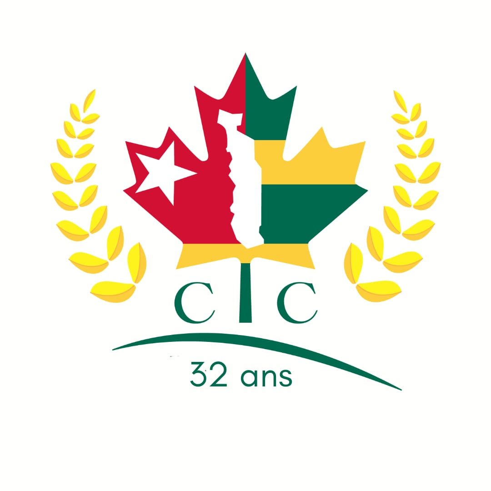

# Shiny app for CTC

#  

A RShiny-based dashboard for monitoring, analyzing the data of CTC...
[![CTC]](https://ctcanada.org/)

## 🚀 Features

- 📊 View distribution of Togolese community in Canada
- 📈 View memebership Trend
- 📊 View section specific need


## 🏗️ Architecture

```
CTC-Shiny-App/
├── app.R                     # Main application code
├── views/                  
│   ├── A propos              # About page - explain what the dashboard is about
│   ├── La CTC                # Provides few statistics descriptive about the Togolese community
│   ├── Les adhesions         # Provide membership trend through the years
│   ├── Les sections          # Work in progress
├── datactc.RData             # RData files uses to display the dashbord

```

## 🛠️ Where it is published

```bash
the app is hosted in https://www.shinyapps.io/. The app link is the following:
```
